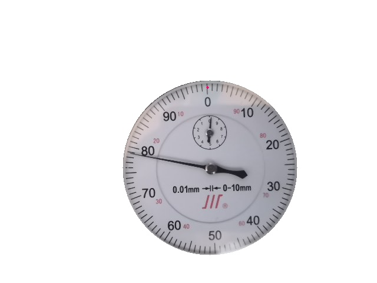
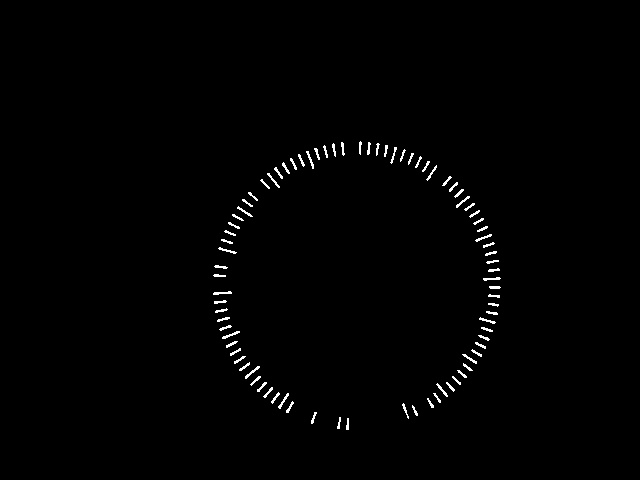
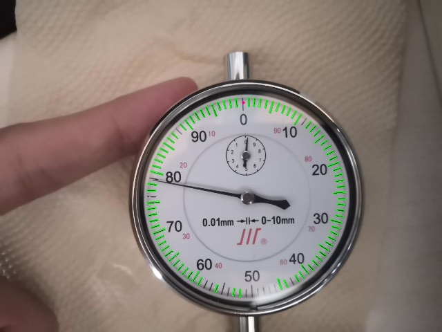
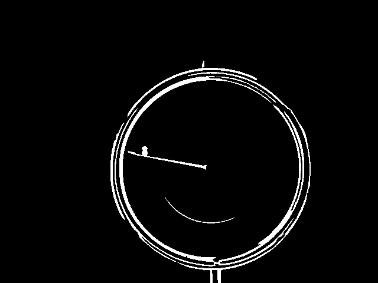
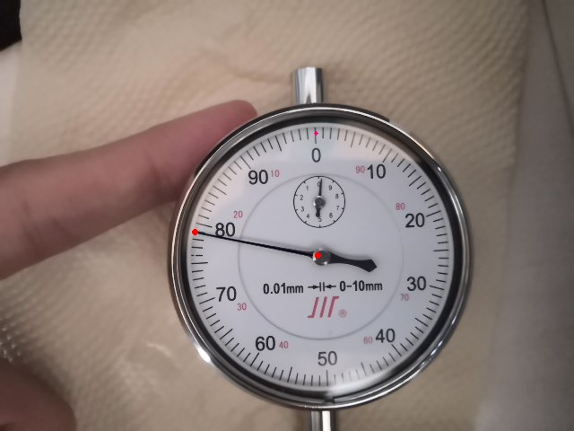

# 基于Opencv-Python的指针式仪表识别
 
cocos.zip 里有500多种的仪表图像实例标注
## 1.使用方法
***
### 安装相关的库 
> pip install -r requirments.txt
```python
numpy==1.19.5
opencv_python==4.5.5.64
```
### 运行
> python main.py

`<main.py>`
```python
from MeterClass import *
if __name__ =="__main__":  

    #多张图片，修改输入文件夹

    # imglist=glob.glob('input/*.jpg')  
    # for imgpath in  imglist: 
    #     A=MeterDetection(imgpath)
    #     A.Readvalue()
    #一张图片
    imgpath='images/1.jpg'
    A=MeterDetection(imgpath)
    readValue=A.Readvalue()

```
## 示例
***
**输入**


> 输出








